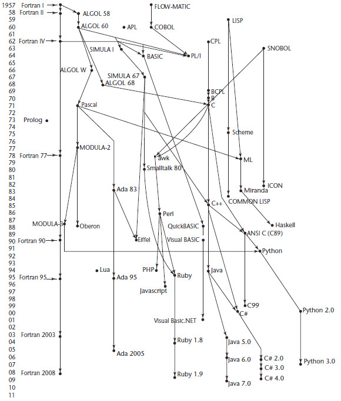
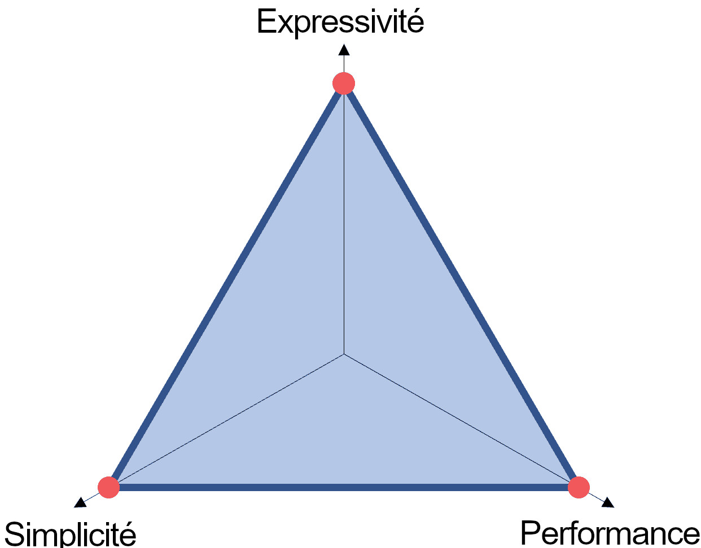
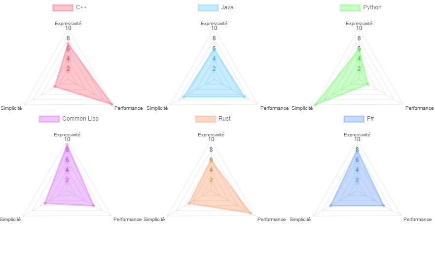
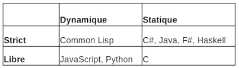

# INF1018 - Chapitre 1

## Bienvenu dans ce cours d'Analyse de Programme!

### Quelques mots par rapport à moi

Mon nom est William Flageol, je suis enseignant à l'UQTR depuis maintenant 5 ans. J'ai aussi enseigné brièvement à l'UQAM. J'ai terminé mon doctorat en Génie Logiciel à l'Université Concordia en 2023.

Mon domaine de recherche porte sur les langages de programmations et les patrons de conception. Je m'intéresse présentement à la combinaison des fonctionnalités des langages fonctionnels et orientés objet.

De plus, j'ai une dizaine d'années d'expérience dans l'industrie en tant que développeur et architecte logiciel. Voici un aperçu des endroits où j'ai travaillé :

* 2008-2009 : Soutien technique chez Service Canada et Revenu Canada;
* 2010 : Programmeur chez ICO Technologies, Shawinigan;
* 2011-2012 : Contrats de programmation indépendants;
* 2012-2013 : Soutien au développement chez Groupe LGS, Québec;
* 2014-2015 : Développeur/Chef d'équipe chez 6i Solutions, Trois-Rivières;
* 2015-2019 : Architecte logiciel chez Groupe CGI, Shawinigan.

J'ai utilisé un bon nombre de technologies et langages de programmation autant professionellement que pour des projets personnels. Entre autres, je programme couramment en C#, F#, JavaScript, Kotlin et Common Lisp.

## Section 1 - Logistique du cours

Comme mentionné dans le plan de cours, ce cours est divisié en trois parties importantes :

* Les notes de cours que vous lisez présentement;
* Les travaux à faire tout le long de la session, ainsi que les examens, qui seront la base de votre évaluation;
* Les séances du mercredi après-midi où nous verrons des exemples, études de cas et où je répondrai à vos questions.

**Il est important de suivre et lire les notes de cours tout le long de la session. Je ne répondrai pas aux questions dont les réponses se trouvent dans ces notes durant les séances.**

Les notes de cours sont une version explosée et détaillée des présentations de Mourad Badri (2021).

### Comment me contacter

J'ai créé un serveur Discord pour le cours que je vous invite de joindre. Vous pouvez utiliser la salle _Questions_ pour me poser des questions concernant les travaux ou demander des clarifications concernant la matière.

S.V.P. évitez de m'envoyer des questions par courriel; j'en reçois déjà beaucoup trop et il se pourrait que votre question se perde. Discord est l'outil à utiliser pour me contacter.

### Disponibilité

Je réserve une partie (idéalement la moitié) de chaque séance de cours que vous laisser le temps de lire les notes de cours, travailler sur les différents travaux au cours de la session et me poser des questions.

Je serai aussi disponible tous les mardi après-midi (jusqu'à 16h) à mon bureau au 3072R. Ma porte reste généralement ouverte, alors vous être libres de venir me voir à tout moment.

Vous pouvez aussi me contacter par message privé sur Discord.

### Avertissement final

Attention, INF1018 est un cours difficile, qui demande un travail continue et régulier durant la session. Il y a beaucoup de travaux à remettre, en plus des examens; si vous tentez de tout faire en même temps la dernière semaine, vous allez très certainement vous planter. Vous devrez gérer votre temps intelligemment pour bien réussir ce cours!


### Outils et technologies

Tout au long du cours, la majorité des explications et exemples seront donné en utilisant deux paradigmes : la programmation procédurale et la programmation fonctionnelle. _Nous ne verrons pas de code orienté objet dans ce cours._ Nous utiliserons le langage F# et la plateforme Microsoft Visual Studio. Les devoirs devront obligatoirement être complétés avec F#. Le langage et paradigme utilisé pour votre projet sera laissé à votre choix.

## Section 2 - Étude, classification et évaluation des langages de programmation

Les langages de programmation n'ont pas toujours eu leur forme moderne; ils ont évolués à partir de formes plus primitives. Nous appelons généralement les langages modernes comme Java et C++ des _langages de haut niveau_, alors que les premiers langages machines sont dénommés _langages de bas niveau_.

D'une façon plus systématique, nous pouvons catégoriser les langages de programmations en *générations*.

#### Langages de première génération : Langage machine, binaire

> _Il y a _10_ sortes de personnes dans le monde : ceux qui comprennent le binaire et ceux que non._

À la base, tous les composants d'un ordinateur communiquent en langage binaire via des signaux électriques. Les langages de base de l'informatique sont donc des langages binaires.

Ces langages :

* Sont inadaptés à la lecture par des humains.
* Ne conviennent pas à la programmation;

#### Langages de deuxième génération : Langages d'assemblage

Pour permettre à des programmeurs de développer des applications sans avoir à apprendre à parler le binaire en langue seconde, des assembleurs ont été créés. Un assembleur permet à un programmeur de s'exprimer en langage d'assemblage, qui sera ensuite traduit par l'assembleur en langage machine.

Les langages d'assemblages initiallement avait une équivalence exacte entre chaque instruction et sa représentation binaire. Aujourd'hui, les assembleurs font des optimisations basé sur le matériel utilisé (CPU, GPU, etc.) et sont plus proches de langages de troisième génération.

Les langages d'assemblage :

* Sont une variante du langage machine lisible par des humans;
* Ont peu de mécanismes de réutilisation;
* Sont très fastidieux à utiliser;
* Sont inadaptés au développement de grandes applications.

#### Langages de troisième génération : Langages modernes

En 1954, le premier langage de troisième génération est créé : Fortran. En 1956, le deuxième est créé :  _LISP_ (ajourd'hui orthographié Lisp). Suivent par la suite une panoplie de langages tels que Algol, Cobol, Simula, Pascal, C, etc.

Ces langages ont été créé pour améliorer la capacité d'expression des programmeurs et sont mieux adapté à la résolution de problème. Ces langages ont vu plusieurs évolutions modernes et ont même été sous-divisés en plusieurs familles.

La famille Algol contient tous les langages basés sur la programmation impérative procédurale, incluant C, C++, C#, Kotlin, Java, JavaScript, Python, etc.

La famille ML (abbréviation de Meta Language) représentent les langages fonctionnels tels que F#, OCaml et Haskell.

La famille Lisp contient les différentes évolutions des langages utilisant la syntaxe Lisp, tels que Clojure, Common Lisp, Racket, Scheme, etc.

Les langages de troisième génération :

* Sont indépendants du matériel machine (CPU, GPU, etc.);
* Sont très lisibles;
* Facilitent l'évolution et la maintenance des logiciels;
* Sont modulaires (disponibilité de librairies);
* Ont un bon équilibre entre flexibilité et simplicité



#### Langages de quatrième génération : Outils de génération

Durant les années 2000-2010, on a vu une ressurgence d'une quatrième génération de langage. À noter, les langages de quatrième génération ont été discutés et existent depuis bien plus longtemps (on peut remonter jusqu'à 1967 avec l'outils Informatics MARK-IV), mais c'est durant la période 2000-2010 que la popularité de ces outils a explosé.

Les langages de quatrième générations sont en fait plutôt des outils permettant le développement d'application sans avoir à écrire de code (ou très peu). Les logiciels comme Microsoft Access, SharePoint, ou PowerBuilder sont des exemples de langages de quatrième génération.

Malgré que toujours utilisés, les langages de quatrième générations n'ont pas pris le dessus en popularité sur ceux de troisième génération. Une des raisons est que ces outils se spécilisent surtout dans un type d'application (généralement les applications de bureautique) et manquent de flexibilité pour bâtir des applications différentes.

## Section 3 - Critères de classification des langages de programmation

Durant ce cours, nous nous concentrerons sur l'analyse des langages et programmes de troisième génération, qui sont les plus utilisés dans l'industrie et en recherche. 

La prolifération de cette génération de langages a fait apparaître différentes catégories, paradigmes, domaines applicatifs, etc. Certains langages se sont imposés et sont devenus des incontournables par traditions. On peut penser par exemple à C, qui a dicté la syntaxe des langages de la famille Algol depuis son inception, ou à JavaScript, qui est devenu la lingua franca de la programmation Web.

Malgré tout, les langages de programmation continuent d'évoluer. De nouvelles versions de langages existants continuent d'être développées et de nouveaux langages sont toujours créé (e.g., Kotlin, Go, Rust, etc.).

Dans cette section, nous nous intéresserons à l'étude des langages de programmation :

* Leur concepts, constructions, structures, etc.;
* Leurs caractéristiques et leur point de vue (paradigme);
* Les points en communs, les différences;
* Les catégories de langages;
* La qualité des langages;
* Leurs domaines applicatifs, capacités de résolution de problème;
* Etc.

### Critères de classification

##### Bas niveau / Haut niveau

Comme discuté plus haut, les langages de programmation sont souvent classifiés de _haut niveau_ ou _bas niveau_. Généralement, cette classification peut être associée directement à la génération du langage. Par contre, dans certains cas, on peut retrouver cette classification pour décrire les langages de troisième génération.

En général, les langages de bas niveau sont considérés comme orientés machine et ont un emphase sur la performance et le contrôle fin de la mémoire. Ces langages priorisent souvent des caractéristiques comme le temps d'exécution, l'emprunte mémoire, l'utilisation énergétique, etc.

Les langages de haut niveau permettent une expression plus naturelle des algorithmes et sont orientés résolution de problème, avec moins d'emphase sur la performance. Ces langages priorisent des caractéristiques comme la portabilité, maintenabilité, testabilité, abstraction, etc.

Quelques langages de programmation tentent de combiner à la fois l'efficacité d'un langage de bas niveau et les caractéristiques des langages de haut niveau. C++ est un bon exemple d'un langage qui offre une haute performance et des fonctionnalités de haut niveau. Cependant, il y a un coût à payer en terme de complexité; C++ est un langage difficile à apprendre et complexe à maintenir comparé aux autres langages sa génération.



On peut appliquer le triangle de gestion de projet aux design de langages de programmation!

##### Déclaratif / Impératif

On peut aussi classifier les langages selon leur classe de paradigme : soit déclaratif ou impératif.

Les langages impératif sont centrés processus (ou traitement) et présente un programme comme étant une liste d'instructions détaillées pour la résolution d'un problème. De leur nature, les langages impératifs fonctionnent par modification graduelle de la mémoire jusqu'à ce que le résultat excompté soit optenu (similaire à la machine de Turing).

Les langages déclaratifs sont plutôt centrés données. Les instructions de ces langages permettent au programmeur de spécifier ce qui doit être fait avec les données (on parlera souvent de transformation de données). Ces langages sont généralement d'un _plus haut niveau_ que les langages impératifs (plus expressifs).

##### Types de données

Certains langage se distingue par une spécialisation sur un type de données en particulier. Bien entendu, tous les langages qui nous intéressent pour ce cours ont des facilités pour une grande variété de types de données. Par contre, certains se spécialisent particulièrement pour un type de donnée particulier et permettent une maîtrise de sa manipulation (facilité, efficacité, etc.). Ces langages sont, naturellement, plus souvent des langages déclaratifs (centrés données).

* R est spécialisé dans la manipulation de tableaux et de matrices;
* SNOBOL est spécialisé dans la manipulation de chaînes;
* Common Lisp est spécialisé dans la manipulation de listes;
* Etc.

##### Orientation / Domaines

Quelques langages de programmation se disent _généraux_ : ils permettent le développement d'application de potentiellement n'importe quel domaine. On peut penser aux langages comme C++, C#, F#, Kotlin, Java, Scala, etc. Par contre, beaucoup de langages ont été conçus pour résoudre des problèmes particulier et sont utilisés dans un domaine précis :

* Ada et C sont utilisés pour la programmation système;
* Basic, Pascal et Racket sont des langages orientés éducation;
* Cobol a été inventé pour le développement de programme dans le monde des affaires;
* JavaScript est principalement utilisé pour le développement d'applications Web;
* Prolog est utilisé dans le contexte de résolution de problème de logique;
* Python est un langage de scriptage qui permet la création rapide de petites applications;
* SQL est un langage de requête de base de données;
* Etc.

##### Environnement

On peut également s'intéresser au degré d'interaction des programmes avec leur environnement durant leur exécution. Le type d'interaction le plus commun est celui utilisé par C : le programmeur développe le programme, et une fois terminé, l'exécute pour observer son fonctionnement. Il n'y a pas vraiment d'interaction entre la phase de développement et la phase d'exécution.

Il existe cependant d'autres mode d'interaction; par exemple le REPL (Read Eval Print Loop) utilisé par des langages comme Common Lisp, Python et Smalltalk; où le programme est en constante exécution et le programmeur a accès à faire des modifications pendant que le programme "roule".

D'autres types d'interactions peuvent également être d'intérêt, comme la capacité d'un langage à interfacer avec d'autres programmes ou autres langages. En particulier, la capacité d'un langage à interfacer avec les libraries développées en C est importante, car C est souvent utilisé comme "pont" pour communiquer avec d'autres langages.

##### Extensibilité

L'extensibilité est l'une caractéristiques les plus importantes pour un langage de programmation. Un langage est dit extensible si le programmeur est capable de créer de nouvelles structures (composants, abstractions) et d'étendre, ainsi, le langage en fonction de son habileté et de ses connaissances pour ses besoins spécifiques.

L'extensibilité d'un langage dépend largement des paradigmes de programmation et des fonctionnalités qu'il supporte. Par exemple, dans les langages orientés objet, l'extensibilité est exprimé via les classes et l'héritage. Tous les langages objets ne sont pas égaux cependant! Visual Basic 6 est techniquement orienté objet, mais rend la création de classes personnalisées particulièrement obtuse, ce qui nuit à son extensibilité. En contraste, Smalltalk est probablement le langage orienté objet le plus extensible, dû à son adhérance forte aux principes de base du paradigme (même plus que Java ;).

De loin le paradigme le plus efficace pour promouvoir l'extensibilité d'un langage est le meta-programming. Le concept même de ce paradigme est d'ajouter la possibilité au programmeur _d'étendre le langage même_. En utilisant les fonctionnalités du meta-programming (introspection, réflexion, macros), il est possible d'ajouter des nouvelles structrures, abstractions, et même de nouvelles fonctionnalités au langage. Mieux encore : le meta-programming n'a pas de coût en performance pour ce gain en expressivité, car ces fonctionnalités sont généralement résolu au niveau du compilateur. Le coût à payer est donc en complexité, ce qui explique pourquoi peu de langages supportent le paradigme entièrement.

##### Paradigmes

Comme discuté au premier cours (voir la présentation du premier cours), chaque langage de programmation supporte un ou plusieurs paradigmes. Un paradigme est une approche dans la résolution de problème; soit une manière de penser et d'organiser un esolution. Il existe une panoplie de paradigmes de programmation : fonctionnel, logique, orienté aspect, orienté objet, procédural, etc.

La plupart des langages supporterons un paradigme principal, et intégrerons possiblement des fonctionnalités d'autres paradigmes. Quelques exemples :

* Java est principalement orienté objet, mais les versions récentes ont ajouté des fonctionnalités de programmation fonctionnelle (expressions lambda, records, etc.);
* Rust est un langage procédural, mais supporte beaucoup de notions de programmation fonctionnelle et orienté objet.;
* F# et Scala sont des langages principalement fonctionnels, mais supportent entièrement le paradigme orienté objet.

D'autres langages ont été conçus pour être multiparadigmes :

* C++ est un langage à la fois procédural et orienté objet, avec certaines notions de programmation fonctionnelle et de meta-programming;
* Common Lisp supporte autant la programmation procédurale, fonctionnelle, orienté objet et le meta-programming. Comme discuté plus haut, ses capacités de meta-programming permettent au langage d'adopter facilement de nouveaux paradigmes.

## Section 4 - Évaluation des langages de programmation

Il y a différentes façons d'évaluer et de comparer les langages de programmation. Généralement, on se concentre sur l'aspect résolution de problème; soit son expressivité. Mais, comme vu précédemment, il y a d'autres critères : la performance et la complexité (ou simplicité) du langage.

Une des raisons d'étudier et d'évaluer des langages de programmation est de déterminer l'impact qu'ils peuvent avoir sur le processus de développement et, ultimement, sur la qualité des programmes.



### Critères d'évaluation

Hormis les trois critères principaux de performance, expressivité et complexité, on peut sous-diviser davantage pour obtenir plusieurs sous-critères d'évaluation plus précis. 

Quelques exemples : 

* Lisibilité
* Facilité d'écriture
* Fiabilité
* Modularité
* Portabilité
* Vitesse d'exécution
* Emprunte mémoire
* Etc.

Élaborons sur quelques un de ces critères...

#### Lisibilité

La lisibilité est un critère qui, à première vue, semble très important lors de l'évaluation de langage de programmation. La facilité de maintenance et l'évolution d'un programmes est certainement déterminée, en partie, par leur lisibilité. On peut aussi tracer des liens avec la compréhension, les tests et mise au point, etc.

La réalité cependant est que la lisibilité est un critère particulièrement difficile à définir de façon systématique; le critère est presque toujours utilisé de façon subjective. Par exemple, un programmeur qui ne connait que Java trouvera certainement un programme C++ pratiquement impossible à lire. De même, un programmeur C aura probablement de la misère à suivre toutes les indirections et appels entre objets d'un programme Java. Ce problème met à la lumière l'importance de connaître différents langages et styles : vous aurez plus de faciliter à lire tout les programmes.[^1] 

Malgré tout cela, on peut tout de même tenter d'établir certaines mesures pour évaluer la lisibilité d'un langage de programmation. Entre autre, on peut s'intéresser à la simplicité du langage lui-même, ainsi qu'à ses éléments de syntaxes.


###### Simplicité

Un langage peut être dit simple lorsqu'il a peu de composantes élémentaires. Plus il y a de manières différentes d'effectuer une opération, plus la simplicité d'un langage sera affectée. C'est pourquoi C++ est plus complexe que Python, par exemple.

La capacité de bien structurer les comportements et les données porte aussi un avantage à la simplicité. C'est un des avantages du paradigmes orienté objet; le comportement et les données sont encapsulés ensemble dans des objets, ce qui rend la lecture du programme plus facile (en théorie, en pratique les choses sont plus compliquées).

###### Instructions de contrôle

Il est généralement reconnu que l'utilisation de l'instruction de contrôle `goto` réduit fortement la lisibilité et compréhensibilité d'un programme. C'est pourquoi à travers le temps plusieurs expressions de contrôles de flot ont été développés.

Les langages impératifs supportent tous une ou plusieurs variantes des instructions `for` et `while`, permettant un meilleur contrôle sur les boucles et rendant le code plus lisible. Plus récemment, les instructions style `foreach` et `range` sont de plus en plus supportés et permettent une meilleure lisibilité et prévention des erreurs.

Les langages déclaratifs utilisent une approche différente, optant plutôt pour des instructions orientée données. Ces langages auront généralement des variantes des instructions `map`, `fold` et `reduce`, qui permettent d'effectuer des transformations sur des listes de données.

La plupart des langages modernes aujourd'hui supportent les deux approches (e.g., Java a la librairie `Streams` et C# `Linq` qui implémentent les instructions du style déclaratif).

Les instructions et fonctionnalités d'un langage ont aussi un impact important sur l'expressivité du langage. Comparez les trois approches suivantes pour appeler une fonction `print` sur tous les éléments d'une liste :

Approche avec `goto` en C :
```
int i = 0;

loopStart:

print(list[i]);

i++;
if(i < list.Length)
  goto loopStart;
```

Approche avec boucle `for` classique en C :
```
for(int i = 0; i < list.Length; i++) {
  print(list[i]);
}
```

Approche avec boucle `foreach` en C# :
```
foreach(var element in list) {
  print(element);
}
```

Approche déclarative avec `map` en F# :
```
map print list;
```

Vous serez certainement d'accord que les deux dernières approches sont plus simples et expriment mieux l'intention du programmeur que la première. La deuxième approche dépend de votre familiarité avec les boucles `for`. Pour certains, cette approche peut être aussi lisible et claire que les deux dernières. Mais la boucle `for`, dans cette situation, expose le comportement interne du programme (manque d'encapsulation), ce qui augmente le risque d'erreur (e.g., possibilité de dépasser la taille de la liste si les conditions sont mal écrites).

###### Support à l'abstraction

Le degré d'abstraction permis par un langage de programmation ainsi que son expression naturelles sont importants pour sa facilité de lecture et d'écriture. C'est une des raisons principales de la création de plusieurs paradigmes de programmation, comme l'orienté objet et l'orienté aspect. 

La programmation procédurale ne permet pas beaucoup d'abstraction (généralement des structures et des procédures). L'orienté object a amené le concept de polymorphisme objet, qui permet d'abstraire le comportement d'une hiérarchie d'objet.

Polymorphisme objet en Java :
```
Parent a;
 
a = new subclass1();
a.Print();
 
a = new subclass2();
a.Print();
```

En programmation fonctionnelle, le concept de polymorphisme existe aussi pour faire de l'abstraction, mais est utilisé au niveau des fonctions. Ce concept existe aussi dans certains langages objets (comme C# et Java) où il est appelé _programmation générique_.

Polymorphisme de fonction (méthode générique) en Java :
```
public <T> List<T> fromArrayToList(T[] a) {
    return Arrays.stream(a).collect(Collectors.toList());
}
```

#### Fiabilité

Un programme est dit fiable s'il réalise ce que l'on attend de lui conformément à ses spécifications. La fiabilité d'un programme est effecté par plusieurs caractéristiques du langage dans lequel il a été développé.


###### Vérification de type

Explorons une des caractéristiques importantes de la fiabilité d'un programme, soit sa capacité à gérer et sécuriser ses types de données. Pour cette caractéristiques, on peut séparer les langages en deux ensembles de deux catégories :

* Un langage peut avoir un typage strict ou libre.
* Un langage peut être typé statique ou dynamique;

Les langages à typage strict font des vérifications pour s'assurer que les interactions entre les différents types de données sont conformes à une série de règles (e.g., le [principe de substitution de Liskov](https://fr.wikipedia.org/wiki/Principe_de_substitution_de_Liskov)). Ces langages ne permettront pas, par exemple, d'effectuer une opération d'addition entre des types `integer` et `string` (soit le programme ne compilera pas ou lancera une erreur à l'exécution). Les langages à typage libre feront très peu de ce genre de vérification et laisse au programmeur la responsabilité d'effectuer des opérations qui ont du sens.

Les typage statique ou dynamique détermine le moment auquel les vérifications sont effectuées. Les langages statiques vérifie la cohérence des types à la compilation, alors que les langages dynamique le font à l'exécution. Généralement, les langages _compilés_ ont tendance à être à vérification _statique_, mais ce n'est pas obligatoirement le cas! Common Lisp est un exemple d'un langage compilé à vérification dynamique.

Donc, en combinant ces deux catégories, on peut obtenir une matrice pour classifier nos langages :



Généralement, il est considéré plus avantageux d'avoir un typage strict plutôt que libre. Les erreurs commises dû à une mauvaise interaction entre types peuvent être très difficile à découvrir et à corriger et un typage plus strict aide à prévenir ce genre d'erreur. À noter qu'il existe différents niveaux de typage strict parmis les langages; par exemple Haskell est beaucoup plus strictement typé que Java (e.g., Haskell ne permettra pas d'additionner un `float` à un `integer` sans conversion, alors que Java laissera passer).

La question du typage statique ou dynamique est plus complexe. Il n'y a pas vraiment de concensus sur la meilleure façon de faire. Les défendeurs du typage statique affirment que toutes les erreurs détectées par le compilateur sont des erreurs qui sont évitées. Il y a certainement du mérite à ce point de vue; un programme Haskell qui compile va souvent fonctionner sans erreurs, alors que la même chose ne peut pas être dite pour un programme C qui compile. 

Cependant, les défendeurs du typage dynamique affirment que le typage statique fait perdre de la flexibilité et expressivité au programme et que les erreurs décelées par le compilateur seront aussi décelées par des tests unitaires, que tout programme devrait avoir de toute façon.


## Références et lectures connexes

Rebort W. Sesta, _Concepts of Programming Languages_, 5th edition, Addison Wesley, 2002

* Chapitres 1 et 2.

R. A. Finkel, _Advanced Programming Language Design_, Addison Weskley, 1996.

* Chapitre 1.

[^1]: Si vous êtes intéressés à en savoir plus sur ce phénomène, jetez un coup d'oeil à cet [article](https://paulgraham.com/avg.html) de Paul Graham (créateur entre autres du forum Hacker News).
