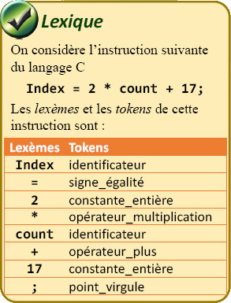
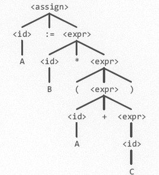
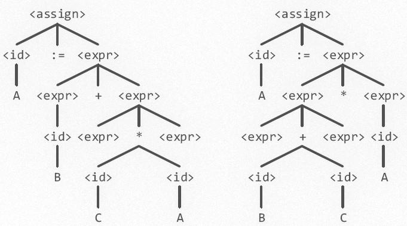
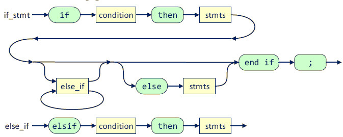
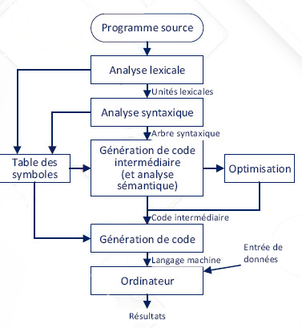
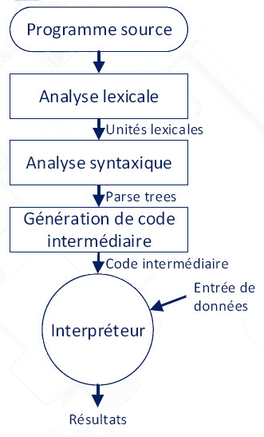

# INF1018 - Chapitre 2

## Syntaxe et sémantique des langages de programmation

Maintenant que nous avons vu un aperçu de l'évaluation et la comparaison de différents langages de programmation, nous nous intéressons à la syntaxe de ces langages. Nous verrons dans ce chapitre les généralités concernant la syntaxe des langages ainsi qu'une façon de décrire formellement une syntaxe. Nous ferons ensuite un survol des notion d'analyse sémantique et de compilation et interprétation des langages.

##### Exercices

Tout au long des notes de cours, des exercices seront présentés à résoudre pour mettre en pratique votre compréhension de la matière. Je vous suggère fortement de compléter ces exercices, car nous en ferons la correction et discussion au cours suivant!


## Section 1 - Introduction et généralités

Décrire formellement un langage de programmation n'est pas nécessairement une tâche facile, mais elle est essentielle si l'on veut pouvoir créer des outils pour travailler avec ce langage (analyseurs, compilateurs, interpréteurs, etc.). La documentation d'un langage de programmation doit nécessairement être _claire et précise_.

On peut diviser la description d'un langage de programmation en deux étapes formelles :

### La définition de la syntaxe

Dans cette étape, on décrit structure de la syntaxe du langage; à quoi ressemble un programme bien formé. Entre autres, on renseigne sur les différentes constructions du langage, ses expressions, ses instructions, la façon de structurer ses unités de programmes, etc. Si on fait un parallèle avec les langues naturelles écrites, la définition de la syntaxe est similaire à l'orthographe du langage.

#### Le lexique

Un programme est un _ensemble de chaînes de caractères d'un alphabet donné_ (**phrases** ou **instructions** du langage). Les unités lexicales d'un langages déterminent les composants de bases, ou les *"mots"* de son vocabulaire. Les vocabulaires des différents langages modernes ont souvent beaucoup de mots en commun.

Les unités de base de description d'un langage sont appelées **_lexèmes_**. La description de ses lexèmes est généralement donnée par une **spécification lexicale**. Les lexèmes d'un langage de programmation incluent les identificateurs, mots spéciaux, constantes, opérateurs, symboles spéciaux, etc. 

On parlera aussi de _token_, qui sont une catégorisation des lexèmes :



#### La syntaxe

La syntaxe d'un langage décrit les façons correctes d'assembler les unités lexicales pour écrire des programmes. Elle décrit aussi de quelle façon les expressions du langage doivent être structurées.

Par exemple, prenons une instruction conditionnelle classique :

```if (<expression>) <instruction>;```

Si la valeur de l'expression `<expression>` est _vraie_, l'instruction `<instruction>` est alors exécutée.

On voudra généralement utiliser des moyens formels pour décrire la **grammaire** d'un langage. La **grammaire** est la description de l'ensemble de tous les symboles terminaux et non-terminaux d'un langage, ainsi que ses règles syntaxiques. Les règles syntaxiques spécifient la façon de structurer les instructions (phrases) d'un langage à partir de son alphabet.

Voici quelques exemples de code qui pourraient être invalides selon des règles syntaxiques :

```
string; // Pas de nom de variable.

string s // Pas de point-virgule.

y = x +; // Un seul opérateur donné à l'opérateur binaire +.

if (x > 2); // Aucune instruction si la condition est vraie.
```


### La définition des sémantiques

L'objectif de cette étape est d'attacher un sens aux éléments syntaxique décrit dans la définition de la syntaxe. On veut renseigner sur la signification de ses constructions, expressions, etc. Cette étape peut être comparée aux règles grammaticales d'un language naturel.

Les deux étapes de définition sont étroitement liées, étant donné que l'une bâti sur l'autre. En général, l'étape de définition de la sémantique est relativement plus complexe que celle de la syntaxe.

#### La sémantique

La sémantique d'un langage a pour objectif de faciliter la compréhension du langage, mais aussi la conception d'outil (compilateurs, interpréteurs, etc.) et son évolution. De plus, un langage voudra permettre la création d'outil pour supporter sa vérification et son analyse (analyseurs statiques).

La description de la sémantique d'un langage se fait généralement de façon formelle. Une description en langage naturel, quoi que plus facile à produire, manquerait de précision. Les humains ne sont en général pas très doué en matière d'exactitude et de penser à tous les détails fins. Les ordinateurs nécessitent une précision extrême pour fonctionner correctement. Il faut donc une approche formelle, systématique.

La sémantique d'un langage a des aspects **statiques** et **dynamiques**. 

La sémantique statique concerne les règles de types (affectées par le typage stricte ou libre), les contraintes structurelles et la vérification statique en général. 

Par exemple, les règles sémantiques d'un langage pourraient spécifier que les expressions suivantes sont invalides :

```
string i = 42; // Mauvais type

x = 50; // Variable non déclarée

int j = 12;
i + j; // Opération invalide entre les types données

```

La sémantique dynamique concerne la signification des expressions, leur interprétation et les effets résultats de leur exécution.

Par exemple :

```
string s; // Création d'un espace mémoire qui sera associé au nom s.

s = "Hello World"; // Écriture de la chaîne Hello World à l'espace mémoire marqué par s.

print(s); // Appel de la fonction print avec l'argument s.
```

## Section 2 - Description formelle de la syntaxe

Vers la fin des années 1950, John Backus et Noam Chomsky développent la même notation qui, depuis, est devenue la méthode la plus largement utilisée pour la description formelle de la syntaxe des langages de programmations. Noam Chomsky présentera une méthode permettant la création de _grammaires libre de contexte_ ou **Context-Free**.

John Backus introduira une notation formelle pour la description de la syntaxe des langages de programmation pour la description de Algol 58. Cette notation sera ensuite modifiée par Peter Naur pour la description de Algol 60. Cette révision sera la base de la notation pour la description formelle de la syntaxe connue sous le nom de notation **_Backus Naur Form_** ou notation **_BNF_**. 

### Notation BNF

La notation BNF est ce que l'on appelle un _métalangage_, soit un langage utilisé pour la description d'un autre langage. Cette notation est specialisé pour la définition de langages de programmation. Elle utilise des abstractions pour les structures syntaxiques et les constructions du langage, appelés **symboles non terminaux**.

Voici un exemple d'instruction d'affectation en notation BNF :

```
<affectation> -> <variable> = <expression>
```

Une telle définition est appelée une règle, ou production. `<variable>` et `<expression>` sont des abstractions et doivent être définies ailleur dans la description formelle. Cette règle pourrait décrire l'instruction suivante :

```
total = var1 + var2
```

L'abstraction `<variable>` est représentée par la variable `total` (une autre règle BNF devra exister pour définir ce qu'est une variable) et `<expression>` est représentée par l'expression `var1 + var2` (idem pour expression). L'ensemble (`total = var1 + var2`) est donc validé comme étant une `<assignation>`.

Dans l'exemple ci-dessus, les abstractions `<affectation>`, `<variable>` et `<expression>` sont des **symboles non terminaux**. Les lexèmes `total`, `=`, `var1`, `+` et `var2` sont des **symboles terminaux** (i.e., pas des abstractions). 

Un symbole terminal peut avoir plusieurs définition, dépendamment du contexte. Par exemple, la symbole terminal `Total` pourrait être une variable dans un contexte et un nom de structure dans un autre contexte.

Une grammaire peut être définie comme un ensemble de règles BNF décrivant tous les **symboles terminaux** et **non terminaux**.

#### Processus de dérivation

Le processus que nous avons suivi de façon informelle dans l'exemple précédent est ce que l'on appelle une **dérivation**. C'est à travers ce processus qu'on peut générer les phrases valides d'un langage : en appliquant les règles de la grammaire séquentiellement jusqu'à ce que l'on obtienne que des **symboles terminaux**.

Dans le cadre d'un programme complet, la dérivation commence par le **symbole de départ** (ou _start symbol_). Elle s'arrête lorsqu'il n'y a plus de **symboles non terminaux**.

Considérons la grammaire suivante :

```
<programme>          := begin <liste_instructions> end
<liste_instructions> := <instruction>
                      | <instruction> ; <liste_instructions>
<instruction>        := <var> := <expression>
<var>                := A | B | C
<expression>         := <var> + <var>
                      | <var> - <var>
                      | <var>
```

Le langage définit par cette grammaire a un seul type d'instruction, soit l'affectation (abstraction nommée `<instruction>`). Un programme, dans ce langage, consistera en le mot spécial (**symbole terminal**) `begin`, suivi d'une liste d'instruction (**symbole non terminal**), séparées par des points virgules (**symbole terminal**), suivie du mot spécial `end`.

Voici un exemple de programme en ce langage :

```
begin
  A := B + C;
  B := C;
end
```

Et voici le processus de dérivation, étape par étape :

* On débute avec l'abstraction du programme complet (`<programme`>) :

```begin <liste_instructions> end```

* On dérive l'abstraction `<liste_instructions>`. À noter que `<liste_instructions>` a deux dérivations possibles, dénotées par le symbole `|`. Nous appliquerons la deuxième dans ce cas-ci, car il y a plus qu'une instruction dans notre programme :

```begin <instruction> ; <liste_instructions> end```

* On dérive ensuite l'abstraction `<instruction>` :

```begin <var> := <expression> ; <liste_instructions> end```

* Ensuite `<var>`, qui a plusieurs choix, alors prenons `A` :

```begin A := <expression> ; <liste_instructions> end```

* Nous avons atteint un **symbole terminal**, continuons la dérivation avec le prochain **symbole non terminal**, soit `<expression>`. Expression a aussi plusieurs dérivations possible. Comme notre code veut faire une addition, prenons cette dérivation :

```begin A := <var> + <var> ; <liste_instructions> end```

* Dérivons les deux éléments var, leur donnant différents noms valides :

```begin A := B + <var> ; <liste_instructions> end```

```begin A := B + C ; <liste_instructions> end```

* On continue à dériver jusqu'à ce qu'il ne reste plus de **symboles non terminaux** :

```begin A := B + C ; <instruction> end```

```begin A := B + C ; <var> := <expression> end```

```begin A := B + C ; B := <expression> end```

```begin A := B + C ; B := <var> end```

```begin A := B + C ; B := C end```

##### Exercice

Comme exercice, faites la dérivation de l'instruction `A := B * (A + C)` à partir de la grammaire suivante :

```
<assign> := <id> := <expr>
<id>     := A | B | C
<expr>   := <id> + <expr>
          | <id> * <expr>
          | ( <expr> )
          | <id>
```

#### Arbres syntaxiques

Une caractéristique des grammaires BNF est qu'elles décrivent les structures syntaxiques des phrases de langages qu'elles définissent sous forme hiérarchique. Cette structure hiérarchique est nommée **arbre syntaxique** (ou _parse trees_).

Considérez l'instruction de l'exercice précédent. Son arbre syntaxique serait le suivant :



Les noeuds internes de l'arbre représentent des **symboles non terminaux** et les feuilles de l'arbre représentent les **symboles terminaux**. Chaque sous-arbre de l'arbre syntaxique décrit une _instance_ d'une abstraction dans l'instruction.

Les arbres syntaxiques sont souvent utilisés par les analyseurs syntaxiques des langages de programmation!

#### Ambiguïtés

Une grammaire qui produit une phrase pouvant avoir plusieurs arbres syntaxiques différents est dite **ambiguë**. Cette ambiguïté syntaxique des structures d'un langage _pose un problème lors de la compilation_. Comme mentionné précédemment, les ordinateurs ont besoin de précision extrême pour fonctionner. Lorsque plusieurs choix de solutions sont possibles, le concepteur d'un compilateur devra effectuer un choix : prendre l'une ou l'autre des solutions et générer le code correspondant. 

Si la différence entre les solutions est significative, le comportement du langage sera à ce moment dit **non défini**, car deux compilateurs pourraient donner deux résultats différents.

Toujours avec la même grammaire, l'instruction suivante pose un problème, car elle correspond à deux arbres syntaxiques différents :

```
A := B + C * A
```



La différence est au niveau du groupement des opérations. Le premier arbre groupe l'opération `C * A` en une expression, alors que le deuxième arbre groupe `B + C`. Ceci pourrait créer une différence dans l'interprétation au niveau de la priorité des opérateurs!

#### Priorité des opérateurs

Pour faciliter l'interprétation du langage, on veut grouper les opérateurs prioritaire en bas de l'arbre. La façon de procéder en BNF est d'utiliser différentes abstractions aux opérateurs de différentes priorités.

Par exemple, on peut étendre notre grammaire ainsi : 

```
<assign> := <id> := <expr>
<id>     := A | B | C
<expr>   := <expr> + <term>
          | <term>
<term>   := <term> * <factor>
          | <factor>
<factor> := ( <expr> )
          | <id>
```

##### Exercice

Faites la dérivation de l'expression A := B + C * A en utilisant cette nouvelle grammaire et dessinez son arbre de syntaxe maintenant unique.

### Notation EBNF

La notation BNF telle qu'initialement présentée possède quelques inconvénients qui rendait fastidieux la définition de certaines règles. 

Par exemple, considérons une règle BNF pour l'instruction classique `if then else` :

```
<condition> := if (<expression>)
                  <instruction>;
             | if (<expression>)
                 <instruction>
               else
                 <instruction>;
```

Remarquez que nous somme contraint de dupliquer l'expression au complet pour les deux possibilités (avec ou sans `else`). La notation EBNF apporte certaines extensions, dont notament :

* La possibilité d'avoir une partie optionelle :

```
<condition> := if (<expression>)
                 <instruction>
               [else <instruction>]
```

* Termes itératifs :

```
<liste_ident> := <identificateur> {, <identificateur>}
```

* Choix multiples imbriqués :

```
<inst_for> := for <var> := <expr> (to | downto) <expr>
                do <instruction>;
```

On appelle les crochets [], parenthèses () et accolades {} des **métasymboles**.

En utilisant la notation EBNF, on peut étendre et simplifier notre grammaire d'assignation.

```
<assign> := <id> := <expr>
<id>     := A | B | C
<expr>   := <term> {(+|-) <term>}
<term>   := <factor> {(*|/) <factor>}
<factor> := ( <expr> ) | <id>
```

### Graphes syntaxiques

Les règles BNF et EBNF peuvent être représentées sous forme de _graphe orientés_ que l'on nommera _graphe syntaxique_ ou _diagrammes syntaxiques_. Représenter la grammaire d'un langage de programmation sous forme de graphes peut parfois augmenter sa lisibilité.

Chaque **symbole non terminal** peut être représenté par un diagramme. Considérons les instruction `if` et `else if` du langage Ada :

```
<if_stmt> := if <condition> then <stmts> {<else if>}
             [else <stmts>] end if ;
<else_if> := elsif <condition> then <stmts>
```

Voici les graphes orientés correspondant :



## Section 3 - Méthodes de description de la sémantique

Certaines caractéristiques des langages de programmation sont difficiles, voire même impossibles pour certaines, à écrire avec la notation BNF ou EBNF.

* Sémantiques statiques :

    Il s'agit de contraintes qui ne peuvent pas être capturées par des descriptions syntaxiques. Ces contraintes incluent les règles de typages et autres contraintes de vérification.

* Sémantiques dynamiques :

    Les règles de langage qui ont trait aux résultats de l'exécution d'un programme ne peuvent pas être exprimées par les règles syntaxiques. Par exemple, dans les langages objet, on ne permet généralement pas d'envoyer un message à un objet inexistant (`null`). Nous verrons plusieurs approches pour exprimer ces règles.

### Approche pour les sémantiques statiques : grammaires à attributs

On peut étendre la notation BNF pour ajouter le support d'attributs. Cette extension permet la description de certaines règles de langage, comme la vérification des types. La vérification de ces règles peut être effectuée durant l'analyse statique et ne nécessite pas l'exécution du code.

> À noter que tous ces exemples de grammaires à attributs sont à titre d'aperçu seulement. **_Vous n'avez pas à apprendre les notations utilisées dans cette section!_** Les notations importantes à comprendre et qui seront utilisées dans le cours sont BNF et EBNF.

Une grammaire à attributs a les caractéristiques supplémentaires suivantes :

* Un ensemble d'attributs `A(X)` pour chaque symbol `X` de la grammaire. L'ensemble `A(X)` contient deux sous-ensembles disjoints :
  * `S(X)` : Attributs de synthèses utilisés pour passer l'information sémantique vers le sommet de l'arbre;
  * `I(X)` : Attributs hérités utilisés pour passer l'information sémantique vers le bas de l'arbre.

À chaque règle de la grammaire est associé un ensemble de fonctions sémantiques et un ensemble de prédicats sur les attributs des symboles de la règle. Si toutes les valeurs des attributs dans un arbre syntaxiques sont calculées, l'arbre syntaxique est alors dit **complètement attribué**.

Voici un exemple de définition de procédure avec règles sémantiques :

```
Syntax rule   : <proc_def> := procedure <proc_name>[1] <proc_body> end <proc_name>[2];
Semantic rule : <proc_name>[1].string = <proc_name>[2].string;
```

Et un exemple de code qui pourrait être dérivé de cette grammaire :

```
procedure DoStuff
  DoSomeSutff();
end DoStuff;
```

La première ligne de la grammaire est la règle syntaxique qui détermine la structure du code. La deuxième ligne est une règle sémantique qui s'assure que le nom de la procédure est le même après `procedure` et après `end`.

À noter que cette notation est incompatible avec EBNF dû à la réutilisation des crochets [] pour noter les instances d'abstraction.

Voici quelques autres exemples basé sur une grammaire d'assignation simple :

Grammaire BNF :

```
<assign> := <var> := <expr>
<expr>   := <var> + <var>
          | <var>
<var>    := A | B | C
```

Avec règles sémantiques :

```
1. Syntax rule   : <assign> := <var> := <expr>
   Semantic rule : <expr>.expected_type <- <var>.actual_type
```

Cette règle exprime que pour que dans une abstraction `<assign>`, le type attendu de l'abstraction `<expr>` sera le même que celui de l'abstraction `<var>`.


```
2. Syntax rule   : <expr> := <var>[1] + <var>[2]
   Semantic rule : <expr>.actual_type <- if (<var>[1].actual_type = int) 
                                           and (<var>[2].actual_type = int)
                                           then int
                                           else real
                                         end if
```

Cette règle exprime que lors d'une expression d'addition, si les deux variables utilisées sont de type `int`, le résultat de l'expression sera aussi de type `int`, sinon il sera de type `real`.

```                                        
3. Syntax rule   : <expr> := <var>
   Semantic rule : <expr>.actual_type <- <var>.actual_type
   Predicate     : <expr>.actual_type = <expr>.expected_type
```

Cette règle a un prédicat, ce qui signifie que pour que l'expression soit valide, le type réel de l'expression et son type attendu doit être le même. La règle sémantique indique que le type actuel de l'expression est déterminé par le type de la variable.

```
4. Syntax rule   : <var> := A | B | C
   Semantic rule : <var>.actual_type <- loop-up(<var>.string)
```

Finalement, cette règle exprime que le type d'une variable est déterminé par le type de l'élément assigné à cette variable (retourné par une éventuelle fonction `loop-up` de l'analyseur statique).

### Sémantique dynamique : quelques approches

Il y a eut plusieurs méthodes développées pour la description de la sémantique dynamique des programmes. Parfois, la sémantique peut être décrite en langage naturel; ce qui la rend généralement imprécise et incomplète (propice aux ambiguïtés). 

Certaines descriptions formelles ont été développées pour tenter de pallier à ce problème et ont été utilisés dans la définition de certains langages avec différents degrés de succès. La réalité est que la description formelle du fonctionnement dynamique (et même statique) d'un langage est très difficile à produire.

Le fait est que pour la plupart des langages, la meilleure description formelle est le code du compilateur. La plupart des langages de programmations ont un compilateur principal qui défini le fonctionnement du langage. Lorsqu'une documentation existe, il s'agit généralement d'une description en langage naturelle[^1].

En général, la définition formelle des langages de programmations s'arrête à la grammaire du langage. Le reste est des outils (analyseurs statiques, compilateurs, débogueurs, interpréteurs, etc.) développés pour les langages et un conscensus (avec documentation en langue naturelle) pour les règles sémantiques.

<a href="https://xkcd.com/927/">

</a>

## Section 4 - Compilateurs et interprétation des programmes

De quel façon traduit-on les énoncés exprimés dans un langage de troisième génération (langage source) en instructions compréhensibles par une machine (langage machine)?

Il existe différentes approches pour effectuer cette traduction : 

* Compilation : Lire et analyser le code source en entier et produire un programme équivalent en langage machine.
* Interprétation : Lire chaque instruction une à une, interpréter les résultats et mettre à jour l'environnement.
* Différentes solutions mixtes : compilations JIT (_Just In Time_), langages intermédiaires, machines virtuelles, etc.

#### Compilation

L'approche de compilation de programme consiste à traduire un programme écrit dans un langage de _haut niveau_ vers le langage machine du matériel utilisé dans l'ordinateur.

Cette méthode présente l'avantage de la performance au niveau de l'exécution, car le programme résultant pourra être directement envoyé au système d'exploitation et rapidement acheminé aux composants physiques.

Le processus de compilation comporte plusieurs phases qui composent une partie du processus de traduction :



* Analyse lexicale

  La première étape du processus est de prendre le programme source, représenté comme une chaîne de caractères, et de la découper en lèxemes et tokens à partir de la définition lexicale du langage.
  
* Analyse syntaxique

  À cette étape, on vérifie que les lèxemes et tokens sont dans le bon ordre et respectent les règles de la grammaire du langage. Ensuite, une représentation intermédiaire est produite pour analyse et génération de code, généralement sous forme **d'arbre de syntaxe abstrait**.
  
* Analyse sémantique

  Vérification des règles sémantiques statiques, optimisation de la représentation intermédiaire, application des macros.
  
* Génération de code

  Traduction de la représentation intermédiaire vers du code d'assemblage. Un assembleur est ensuite exécuté pour traduire le code d'assemblage en code machine. La raison de cette étape supplémentaire est pour éviter que chaque compilateur de langage ait à connaître toutes les marques et standards des composants physiques (CPU, GPU, RAM, etc.). Ce travail est laissé au programme assembleur.
  
#### Interprétation

Le processus d'interprétation est très similaire au processus de compilation dans les premières étapes. Les différences principales sont les suivantes :

* Au lieu d'analyser le programme en entier, l'interpréteur est appelé sur chaque instruction indépdante.
* Certains interpréteurs sautent l'étape d'analyse sémantique.
* Après la génération de la représentation intermédiaire (arbre de syntaxe), le code est directement interprété et exécuté, sans avoir à le traduire vers un langage machine. L'interpréteur agit aussi comme environnement d'exécution du programme.




#### Systèmes hybrides

Une panoplie de différentes approches existent pour la compilation et l'interprétation des langages. 

Une approche populaire, utilisée entre autres par C#, Common Lisp, Kotlin et Java, est de compiler le code vers un langage intermédiaire plus facile à interpréter. Par exemple, C# compile en MSIL (_Microsoft Intermediary Language_) et Java en bytecode. Ce code intermédiaire est ensuite interprété par une machine virtuelle qui agit d'interpréteur entre le code intermédiaire et le système d'exploitation.

#### Comparaison entre les différences approches

En général, la compilation produit des logiciels plus performant, parce que la majorité du processus d'interprétation est fait d'avance par le compilateur et le code résultant est très proche du langage nécessité par les composants physiques.

Dans l'autre extrême, l'interprétation pure est lente parce que pour chaque instruction, le processus doit être répété en entier, et aucune optimisation n'est possible sans connaître l'entièreté du programme.

Aujourd'hui, les processus hybrides voient une excellente performance, malgré le fait qu'ils ne sont que partiellement compilé. Par exemple, C# est maintenant un des langages majeurs utilisés dans le développement de jeux-vidéos, qui sont des applications en temps réel nécessitant une haute performance.

Un autre point à considérer est la facilité de déboguage du programme. Les programmes compilés sont notament plus difficiles à déboguer dû à la problématique d'associer une erreur d'exécution au texte source d'origine. Les programmes interprétés ont un lien direct entre l'instruction et l'exécution et sont donc plus faciles à suivre durant leur exécution.

## Références et lectures connexes

Rebort W. Sesta, _Concepts of Programming Languages_, 5th edition, Addison Wesley, 2002

* Chapitre 3.


[^1]: Voir par exemple les [différentes](https://en.cppreference.com/w/) [références](https://learn.microsoft.com/en-us/cpp/cpp/cpp-language-reference?view=msvc-170) [du langage](https://cplusplus.com/reference/) [C++](https://www.ibm.com/docs/pt/i/7.4?topic=c-ile-cc-language-reference))
