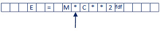

# INF1018 - Chapitre 3

## Analyse lexicale - Rôle, concepts et approches

La semaine dernière, nous avons vu la théorie derrière les concepts d'analyse lexicales et syntaxiques et la façon dont les grammaires des langages de programmation sont structurées. Cette semaine, nous nous intéresserons aux aspects techniques du développement d'un analyseur lexical.

## Section 1 - Rôle de l'analyse lexicale

La nature d'un programme source est essentiellement un fichier texte, soit une chaîne de caractères. Du point de vue d'un ordinateur ou d'un programme, il s'agit d'un long tableau de `char`[^1]. La première étape du processus d'analyse est donc de prendre cette séquence de caractères et de la convertir, ou traduire, en quelque chose de plus facile à manipuler.

[^1]: Simplification; en réalité les caractères d'un programme source sont généralement encodé en Unicode, et non ASCII, comme l'impliquerait un type `char`.

C'est le rôle principal de l'analyseur lexical : retrouver (identifier, reconnaître) les unités lexicales (lexèmes et _tokens_, ou symboles) à partir des caractères en entrée. Le résultat de l'analyse lexicale sera donc une séquence de lexèmes correspondant aux symboles du langage. Cette séquence de lexèmes sera, par la suite, utilisé comme entrée par l'analyseur syntaxique (qui sera le sujet du prochain chapître).

### Principe de l'analyse

Supposons un programme très simple :

```
begin 
  x := 23; 
end
```

La première étape d'un analyseur lexical est de charger le texte du programme en mémoire sous forme d'une chaîne de caractères. Dépendemment des besoins du langage, on peut garder ou non les caractères de saut de lignes (certains langages, comme F# et Python, interagissent avec ces caractères; d'autres comme C++ et Java, les traitent comme des espaces). 

Pour garder les choses simple, notre langage fictif ici ne se souciera pas des sauts de ligne et chargera en mémoire la chaîne de caractères suivante :

```begin x := 23; end```

Comme un programme n'a aucune idée de ce qu'est un mot, sans rien dire d'un lexème ou un symbole, on doit en premier lieur traiter les caractères un à un. On débute l'analyse sur le premier caractère, `b`. Itérativement, on incrémente l'indexe de la liste et observe le caractère suivant, gardant chaque caractère en mémoire, jusqu'à ce qu'on atteingne un espace. Après avoir atteint le premier espace, nous avons en mémoire le mot `begin`.


On place le mot `begin` dans une liste en mémoire et on continue le processus jusqu'à la fin du fichier. À la fin, nous obtiendrons la liste de mots suivants : `begin`, `x`, `:=`, `23`, `;` et `end`.

Parmi les tâches à effectuer par l'analyseur, on peut aussi éliminer les commentaires (e.g., si on rencontre un symbole de début de commentaire, on ignore tout jusqu'à ce qu'on rencontre le symbole de fin de commentaire), les espaces, tabulations, etc. 

Il peut être intéressant de stocker certaines informations sur les mots obtenus, comme par exemple l'indexe de début du mot. Ces informations pourront être utiles pour rapporter l'emplacement des erreurs.

##### Pourquoi on sépare l'analyse lexicale et syntaxique en deux étapes?

Il serait définitivement possible de créer un programme qui fait l'analyse lexicale et syntaxique d'un seul coup. Ce programme serait par contre très complexe et difficile à maintenir. En général en développement, il est bien de diviser nos programmes en unités conceptuelles distinctes pour simplifier. Cela rend notre conception plus modulaire, et permet une meilleure efficacité dans le développement (génie logiciel). La portabilité de notre programme sera aussi accrue.


## Section 2 - Concept de base

### Unités lexicales, modèles et lexèmes

Sachant que l'objectif de l'analyse lexicale est de convertir une chaîne de caractères en entrée en une liste de symboles et lexèmes, on devra fournir un modèle décrivant la liste des symboles permis dans notre langage :


#### Quelques définitions

Avant de continuer, définissons clairement certains termes qui sont utilisés fréquemment :

* Programme source : chaîne de caractères représentant le programme tel qu'écrit par le développeur.
* Analyse lexicale : processus de transformation du programme source en unités lexicales (symboles et lexèmes).
* Symbole (_token_) : représentent une catégorie de "mots", ou lexèmes. (e.g., littéral, identificateur, opérateur, etc.)
* Lexème : suite de caractères du programme source analysé qui concorde avec un symbole. (e.g., `int`, `x`, `<=`, `42`, etc.)
* Unité lexicale : combinaison de symbole et lexème; les unités lexicales forment les **symboles terminaux** dans la grammaire du langage source. (e.g., littéral `int`, identificateur `x`, opérateur `<=`, nombre `42`, etc.)
* Alphabet : ensemble des symboles et règles lexicales d'un langage de programmation.

#### Description et analyse

On doit donc définir la liste des symboles qui sont permis dans le langage source pour pouvoir créer nos unités lexicales à partir du programme source. Voici quelques symboles qui apparaîssent fréquemment dans les langages de programmation :

* Mots clés :

  Permettent de structurer le programme et de déclarer les différentes sections. E.g., `begin`, `end`, `function`, `procedure`, `class`, etc.
  
* Opérateurs

  Représentent des fonctions et opérations de base du langage. Il y a deux types d'opérateurs : unaires et binaires. Les opérateurs unaires s'appliquent sur un seul argument : `inc x`, `dec y`, `&z`. Les opérateurs binaires s'appliquent sur deux arguments (et sont généralement exprimé sous forme d'_infix_, soit placé entre les deux arguments) : `x + y`, `z - a`, `b >= c`, etc. Certains langages n'ont pas besoin d'opérateur binaire dû à leur syntaxe (e.g., Common Lisp, Smalltalk).

* Identificateurs

  Représentent les noms que le programmeur associe aux différents éléments structurels du programme. Il peut s'agir de nom de variables, structures, classes, modules, etc.

* Constantes

  Les constantes suivent typiquement les mêmes règles que les identificateurs, mais sont fixés par le langage comme constante systèmes. Par exemple, en C, `NULL` est une constante représentant le nombre `0`.

* Chaînes littérales

  Tous les langages de troisième génération permettent la déclaration de chaînes de caractères. (Même certains langages d'assemblage le permettent!) La syntaxe utilisée est assez standard : la chaîne est généralement entourée de guillemets `""`. Certains langages utiliseront parfois l'apostrophe `''` (e.g., SQL), ou permettront les deux (e.g., JavaScript).

* Symboles de ponctuation

  Tous les langages utilisent une forme de ponctuation pour structurer leurs instructions. Certains vont utiliser le point virgule `;` pour indiquer la fin d'une instruction, d'autres utiliseront les sauts de lignes, d'autres les parenthèses `()`, etc.
  
##### Modèle lexical
  
Le modèle lexical d'un langage décrit les règles permettant de valider les lexèmes représentant les différents symboles du langage. Par exemple, pour les mots clés, constantes et opérateurs, une liste de lexèmes valides sera fournie pour chacun; si un mot analysé correspond à un élément de ces listes, l'analyseur pourra immédiatement conclure qu'il s'agit d'un lexème associé à un de ces symboles.

Pour les symboles correspondant à des lexèmes complexes (identificateurs, nombres), on peut avoir recourt à des **expressions régulières** (ou **regex**) pour définir leur modèle. Par exemple, un identificateur pourrait être représenté par le **regex** suivant : `[A-Za-z]\w*` (caractère alphabétique optionellement suivit d'un ou plusieurs caractères alphanumériques). Nous ferons un survol de la syntaxe des **regex** plus loin dans ce chapitre. 

## Section 3 - Lecture et mémorisation du texte en entrée

Il existe deux approches générales pour construire un analyseur lexical : la production automatique en utilisant un outil et l'implantation manuelle dans un langage de programmation.

##### Constructeur automatique

Il existe des logiciels permettant de générer un analyseur lexical à partir de spécifications fondées sur les **regex**. La lecture est la mémorisation des unités lexicales est donc fournie par le générateur. Quelques exemples : YACC, ANTLR, JavaCC. À noter que ces générateurs offrent typiquement aussi la création d'un analyseur syntaxique. Nous y reviendrons plus tard dans le cours.

##### Implantantion "manuelle"

On peut relativement facilement créer notre propre programme d'analyse lexicale en implantant nous même les procédures d'analyse et de reconnaissance dans un langage de programmation. Il y a deux approches générales pour implanter un analyseur lexical : l'approche procédurale et l'approche fonctionnelle. Nous discuterons l'approche procédurale dans ce chapitre et je ferai une démonstration de l'approche fonctionnelle durant le prochain cours.

### Lecture du texte source

L'algorithme décrit précédemment pour découper le programme source en lexèmes était simple, mais incomplet. Certaines situations peuvent nécessiter un processus de décision plus complexe pour déterminer si on a atteint la fin d'un mot. 

Considérez le programme source suivant :

```e = m*c**2```

Notre alphabet ici contient les opérateurs binaires `*` (multiplication) et `**` (exposant). 

En premier lieu, imaginons que la lecture a progressé jusqu'à cet endroit :



Justqu'à maintenant, nous avons accumulé les lexèmes `e` et `=`. Le mot en mémoire est présentement `m`. Le prochain caractère est `*`. Il n'y a plus d'espaces dans le reste du programme. Si nous continuons la lecture jusqu'à la fin, nous nous retrouvont avec le mot `m*c**2`, qui ne correspond à aucun symbole dans notre alphabet. Nous devons donc ajouter une condition pour déterminer qu'un mot est complet même si nous n'avons pas atteint d'espace ou la fin du fichier.

Nous pourrions faire une vérification à savoir si le mot en cours correspond à un lexème valide. Si c'est le cas, on continue d'accumuler des caractères dans le mot, sinon on passe au mot suivant. Dans ce cas-ci, la chaîne `m*` ne correspondra pas à un symbole de notre alphabet, alors nous arrêtons l'accumulation à `m` et passons au mot suivant.

Tout semble bien, mais nous nous retrouvons avec une autre situation :


Les lexèmes accumulés sont `e`, `=`, `m`, `*` et `c`. Le mot en mémoire est `*`. Le prochain caractère est `*`. Le mot en mémoire correspond exactement au lexème `*`, soit l'opérateur de multiplication. On ne peut pas ajouter un caractère à ce lexème, car il est complet. Par contre, `**` est aussi un lexème valide, représentant l'exposant. 

Quelle est la liste valide : `[*, *]` ou `[**]`?

Évidemment, l'intention du programmeur était certainement d'utiliser l'opérateur d'exposant, mais l'autre représentation est aussi valide du point de vue de notre analyseur lexical. 

###### Oui, mais `c * * 2` n'est pas une instruction valide!

C'est vrai, mais il s'agit là d'une règle syntaxique. Notre analyseur lexical n'a aucune idée des règles de syntaxes et de ce qui est valide ou non à ce niveau.

La seule façon de résoudre cette ambiguïté au niveau de l'analyseur est d'introduire un système de priorité et de donner à `**` une plus haute priorité que `*`. Donc, avant de valider que `*` est un lexème complet, on doit regarder le prochain caractère pour voir si en fait le lexème devrait être `**`. Une façon simple de gérer ce système serait simplement de toujours donner priorité au mot le plus long.

### Expressions régulières

Comme discuté précédemment, les **expressions régulières**, ou **regex**, sont une notion importante pour spécifier les modèles d'un alphabet lexical. Dans un alphabet complet, on doit voir apparaître tout l'ensemble fini des symboles, ainsi que les règles pour la validation des lexèmes. Ces règles peuvent être exprimées sous forme de **regex** : 

* Mots clés : `(begin | end | function | class | struct | ...)`
* Identificateur : `[A-Za-z]\w*`
* ...

#### Quelques instructions **regex**

* `()` : Permet de grouper des sous-expressions. Les parenthèses sont ignorées. Utile pour combiner avec d'autres instructions.

  E.g., `A(B)` : correspond à la chaîne `AB`.

* `|` : dans un groupe, dénote deux possibilités. 
  
  E.g., `A(B|C)` : correspond aux chaînes `AB` et `AC`.
  
* `+` : Le terme précédent peut être répété une ou plusieurs fois.

  E.g., `AB+` : correspond aux chaînes `AB`, `ABB`, `ABBB`, etc.
  
* `*` : Le terme précédent peut apparaître zéro, une ou plusieurs fois.

  E.g., `AB*` : correspond aux chaînes `A`, `AB`, `ABB`, etc.
  
* `[]` : permet de définir un interval de valeur.

  E.g., `[A-Z]` : correspond aux chaînes `A`, `B`, `C`, jusqu'à `Z`.

  E.g., `[A-Za-z0-9]` : correspond aux chaînes `A` à `Z`, ou `a` à `z`, ou `0` à `9`.
  
* `\X` : Certains intervals sont pré-générer pour faciliter leurs usage.
  
  E.g., `\w` : correspond à un caractère alphanumérique.
  
  E.g., `\s` : correspond à un caractère "blanc" (espace, tabulation, etc.).
  
* `.` : Correspond à n'importe quel caractère.

Pour plus d'information, consultez une des [références](https://learn.microsoft.com/en-us/dotnet/standard/base-types/regular-expression-language-quick-reference) [disponibles](https://docs.oracle.com/javase/8/docs/api/java/util/regex/Pattern.html) [en ligne](https://developer.mozilla.org/en-US/docs/Web/JavaScript/Guide/Regular_expressions).

#### Définitions régulières

Pour simplifier la définition de notre alphabet, nous pouvons donner un nom à certaines expression régulières pour pouvoir les réutiliser ailleurs dans notre définition.


#### Exercice

Produisez la définition régulière pour représenter un nombre selon les règles suivantes :

* Débute par un ou plusieurs chiffres : `0`, `123`.
* Peut être suivi par un point, suivi par un ou plusieurs autres chiffres : `0.2`, `14.543`.
* Peut ensuite être suivi par un `E`, suivi par un ou plusieurs autres chiffres : `1.0E2`, `6.02E23`.

Y a-til des lacunes dans ces règles? Pourrait-on écrire des nombre "invalides"?

### Section 4 - Approche procédurale de reconnaissance des unités lexicales

Dans cette section, nous verrons une approche d'analyse lexicale basée sur la construction d'automate. L'objectif est toujours de produire les lexèmes et de les associer aux symboles à partir du programme source.

Dans cette approche, l'analyseur lexical est un automate qui sera éventuellement opéré par l'analyseur syntaxique. L'automate a une fonctionnalité : produire la prochaine unité syntaxique (lexème et symbole). L'analyse lexicale est pilotée par l'analyseur syntaxique.

À noter que nous verrons en classe une approche différente; l'approche fonctionnelle voit l'analyseur lexical comme une fonction indépendante qui transforme le programme source en séquence d'unité lexicales.

#### Construction de l'analyseur lexical

Notre automate utilisera une approche basée sur les diagrammes d'états-transitions. On modélisera en premier lieu la reconnaissance des unités lexicales sous forme de diagramme d'état. Nous traduirons ensuite le diagramme en utilisant un langage de programmation procédural.

##### Un exemple de diagramme d'état pour l'analyse lexicale

Voici un diagramme d'état pour un analyseur lexical reconnaissant trois symboles : noms (identificateurs), mots clés et littéraux entier (nombres) :


Il y a trois états : `Début`, `id` et `int`. Les transitions entre les états sont déterminés par le résultat des lectures. 

On lit le premier caractère; s'il s'agit d'une lettre, on l'ajouter en mémoire et on passe à l'état `id`. L'état `id` lit des lettres et des chiffres tant qu'il y en a et lorsque l'index pointe sur un autre sorte de caractère, appelle une fonction qui détermine si le lexème est un mot clé ou un identificateur et retourne le résultat.

Si le premier caractère était un chiffre, un passe à l'état `int` et on effectue un comportement similaire : on lit jusqu'à ce qu'on tombe sur un caractère qui n'est pas un chiffre, et on retourne le nombre accumulé en mémoire comme étant un entier littéral.

Voici ce à quoi pourrait ressembler la fonction principale de ce diagramme d'état en C :

```
/* lex - a simple lexical analyzer */
int lex() {
	getChar();
	switch (charClass) {
// Parse identifiers and reserved words 
		case LETTER:
			addChar();
			getChar();
			while (charClass == LETTER || charClass == DIGIT) {
				addChar();
				getChar();
			}
			return lookup(lexeme);
			break;
/* Parse integer literals */
		case DIGIT:
			addChar();
			getChar();
			while (charClass == DIGIT) {
				addChar();
				getChar();
			}
			return INT_LIT;
			break;
	}   /* End of switch */
}   /* End of function lex */
```


Voici un autre diagramme d'état, cette fois-ci pour l'analyse d'un modèle pour les opérations de relation (`<`, `>`, `<>`, `=`, `<=` et `>=`) :


Et quelques exemples de parcours de ce diagramme pour différentes instructions :

`>=` : 0 -> 6 -> 7 -> PGE (plus grand ou égal)
`<>` : 0 -> 1 -> 3 -> DIF (différent de)
`= ` : 0 -> 5 -> EGA (égal)
`>6` : 0 -> 6 -> 8 -> (plus grand que; le 6 est ignoré par ce modèle)

#### Exercice

Construisez le diagramme d'état pour la définition régulière que vous avez produite à l'exercice précédent.

Programmez ensuite le code procédural pour implémenter ce diagramme dans le langage de votre choix.

## Section 5 - Génération d'analyseurs lexicaux

Comme mentionné précédemment, il existe plusieurs outils pour automatiquement générer des programmes d'analyse lexicale (programmes qui génèrent d'autres programmes; _compilateurs lexicaux_). Ces programmes basent la génération de l'analyseur sur des notations spécifiques, généralement dérivées des expressions régulières.

L'outil Lex est un tel programme. Il est utilisé pour spécifier des analyseurs lexicaux pour une grande variété de langages. L'outil est composé d'un langage de définition d'alphabet et d'un compilateur.


Une spécification en langage Lex comprend essentiellement trois sections :

```
Déclarations
%%
Règles de traduction
%%
Procédures auxiliaires
```

**Déclarations**

Cette section défini les variables, constantes littérales et expressions régulières, soit l'alphabet du langage à analyser.

**Règles de traduction**

Contient un ensemble de règles sous la forme : 

```
m[1] {action[1]}
m[1] {action[1]}
...
m[n] {action[n]}
```

**Procédures auxilaires**

Librairie de procédures pouvant être appelées par les actions des règles de traductions. L'analyseur lexical créé par Lex est activé par l'analyseur syntaxique; tel que décrit au début de cette section.

### Exemple de spécification Lex

```
blancs	            [ \t]
lettre	            [a-zA-Z]
chiffre	            [0-9]
soulignement	    "_"
lettre_ou_chiffre	({lettre}|{chiffre})
fin_soulignee	    ({soulignement}{lettre_ou_chiffre}+)
identificateur	    ({lettre}{lettre_ou_chiffre}*{fin_soulignee}*)
operateur	        [-+*/]
separateur	        [;,(){}]
%%
{chiffre}+	                {return ENTIER;}
{identificateur}	        {return IDENTIFICATEUR;}
{operateur}|{separateur}	{return yytext[0];}
#[^#\n]*#?	                {/* ignorer commentaire */}
{blancs}	                {/* ignorer les blancs */}	
\n	                        {numero_ligne++;}
.	                        {return ERRONE;}
%%
```

À noter que la section "Procédures auxiliaires" est vide dans cette définition.

Voici un autre example plus complexe :

```
%{
	/* Définition des constantes litterales */
	PPQ, PPE, EGA, DIF, PGQ, PGE,
	SI, ALORS, SINON, ID, NB, OPREL
%}

/* définitions regulieres */
Delim	[ \t\n]
Bl		{delim}+
lettre	[A-Za-z]
chiffre	[0-9]
Id		{lettre}+({lettre}|{chiffre})*
nombre	{chiffre}+(\.{chiffre}+)?(E[+\-]?{chiffre}+)?

%%
{bl}	    {/* pas d'action et pas de retour */}
si	        {return (SI);}
alors	    {return (ALORS);}
sinon	    {return (SINON);}
{id}	    {yylval = RangerID(); return (ID);}
{nombre}	{yylval = RangerNB(); return (NB);}
"<"	        {yylval = PPQ; return (OPREL);}
"<="	    {yylval = PPE; return (OPREL);}
"="	        {yylval = EGA; return (OPREL);}
"<>"	    {yylval = DIF; return (OPREL);}
">"	        {yylval = PGQ; return (OPREL);}
">="	    {yylval = PGE; return (OPREL);}
%%
RangerID() {
/* procedure pour ranger dans la table des symboles le lexeme dont le premier caractere est pointé par yytext et dont la longueur est yyleng et retourner un pointeur sur son entrée */
}
RangerNb() {
/* procedure similaire pour ranger un lexeme qui est un nombre */
}
```

À noter que vous n'avez pas à apprendre ou à utiliser la syntaxe Lex dans ce cours. Par contre, vous aurez l'option d'utiliser l'outil pour compléter certains de vos travaux (il sera mentionné dans le devis du travail si l'outil est permis).

Vous pouvez consulter le code et la documentation de l'outil Flex, qui est une implémentation de Lex et YACC, sur le GitHub suivant : [https://github.com/westes/flex](https://github.com/westes/flex).

## Références et lectures connexes

R. A. Finkel, _Advanced Programming Language Design_, Addison Weskley, 1996.

* Chapitres 1 à 3.


