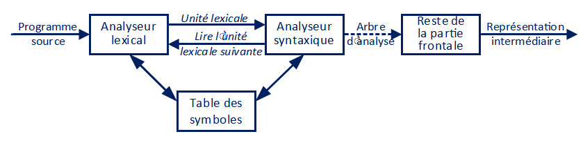
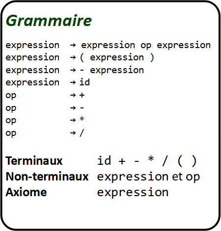

# INF1018 - Chapitre 4

## Analyse syntaxique - Rôle, concepts et approches

La semaine dernière, nous avons vu les différents concepts et techniques derrière l'analyse lexicale. Cette semaine, nous faisons suite à ces éléments en abordant les concepts et technqiues pour le développement d'un analyseur syntaxique.

## Section 1 - Introduction générale

Comme mentionné dans les chapitres précédents, les langages de programmations de troisième génération nécessitent un ensemble de règle pour décrire la structure que doit avoir le code. Tout comme les règles lexicales sont rassemblées dans un **alphabet**, les règles syntaxiques seront rassemblées dans une **grammaire**.

La **grammaire** d'un langage peut être vue comme une description du langage lui-même; c'est la base utilisée par les développeurs d'analyseurs pour le langage. Plus la grammaire est détaillée et systématique, plus le processus de développement d'analyseur est simplifié.

Tout comme pour les analyseurs lexicaux, il y a deux approches pour le développement d'un analyseur syntaxique; soit l'implantation manuelle et la construction automatique avec un outil.

### Rôle de l'analyse syntaxique

Le concept de base d'un analyseur syntaxique mirroire celui de l'analyseur lexicale. L'analyseur lexicale avait la fonction de prendre une chaîne de caractère (le programme source) et de la transformer en séquence d'unités lexicales (lexèmes et symboles). L'analyseur syntanxique prendra en entrée cette séquence d'unités lexicales et l'utilisera pour produire une représentation abstraite du programme (typiquement sous forme d'arbre syntaxique abstrait).

Le premier rôle de l'analyseur syntaxique est de déterminer la validité de la séquence d'unités lexicales en entrée. On veut valider que la séquence en question peut être obtenue par la grammaire du langage et vérifier la concordance de la suite des symboles en entrée avec la structure du langage. 

L'analyseur syntaxique a aussi le rôle de rapporter les erreurs de façon intelligible à l'utilisateur. Idéalement, si une erreur est rencontrée qui n'empêche pas le processus de continuer, on veut pouvoir continuer le traitement et rapporter toutes les erreurs trouvées à la fin (c'est le comportement normal des compilateurs, par exemple).

La sortie sera, en général, une certaine représentation de l'arbre d'analyse. Certaines tâches peuvent également être effectuées (génération de la table de symboles, certains contrôle sémantiques, production de code intermédiaire, extraction d'information pour les besoins d'analyse, optimisation de l'arbre, etc.).



### Types et approches

Il y a deux approches générales pour la construction d'un analyseur syntaxique :

* Approche **descendante** :

  On construit l'arbre syntaxique de la racine (haut) vers les feuiles (bas). L'approche ascendante utilise une grammaire **LL** (_Left to right, Leftmost derivation_). Il s'agit de l'approche la plus simple et celle que nous utiliserons dans la majeure partie de ce chapitre. Cette approche se porte bien à l'implantation manuelle d'un analyseur.

* Approche **ascendante** :

  On construit l'arbre syntaxique des feuilles (bas) vers la racine (haut). L'approche ascendante utilise une grammaire **LR** (_Left to right, Rightmost derivation_). Cette approche fonctionne en plaçant les symboles terminaux dans un _stack_ et en appliquant les règles syntaxiques sur les éléments disponibles dans le _stack_. L'approche ascendante est plus complexe, mais permet de gérer un plus grand nombre de grammaires.

Peu importe la méthode utilisée, la séquence d'entrée est toujours parcourue de gauche vers la droite, un symbole à la fois.

### Traitement des erreurs

Dans un analyseur syntaxique, l'identification et le traitement des erreurs est une tâche importante qui augmente significativement la complexité de la conception des analyseurs. On peut classifier les erreurs retrouvées dans un programme en quatre niveaux :

* Lexical (e.g., identificateur invalide, point virgule manquant, etc.);
* Syntaxique (e.g., mot clé manquant, déclaration de procédure invalide, etc.);
* Sémantique (e.g., appel de fonction inexistante, nombre de paramètre invalides, etc.);
* Logique (e.g., variable non utilisée, appel de méthode sur un type nullable, etc.).

La détection des erreurs sémantiques et logiques est une tâche très difficile, car elle nécessite que le programme ait soit analysé en partie pour déterminer si le code est bien formé. Par exemple, pour détecter si un appel de fonction a le bon nombre de paramètre, on doit d'abord interpréter toutes les fonctions visibles et déterminer leur nombre de paramètres.

Même s'il est possible de détecter les erreurs lexicales au niveau de l'analyseur lexical, cette tâche est généralement reléguée à l'analyseur syntactique. La pratique habituelle est d'ajouter un symbole _erreur_ dans l'alphabet du langage et de traiter l'existence de ce symbole durant l'analyse syntaxique.

#### Récupération des erreurs

Une fois une erreur détectée, on doit déterminer s'il est possible de continuer l'analyse. Cela dépend entièrement du type d'erreur détectée. Pour certain types, il sera difficile de l'ignorer et continuer le traitement (e.g., une erreur syntaxique peut rendre presque impossible la compréhension du reste du code).

On doit déterminer l'impact de l'erreur au niveau de l'analyse; soit quelles sont les parties de l'arbre syntaxique affectées par l'erreur. On peut ensuite ignorer les parties affectées par l'erreur et reprendre une fois que nous sommes hors de la portée d'impact de l'erreur. 

Prenons l'exemple d'erreur suivante :

```
1. int DoStuff() {
2.   int i = 42;
3.   i += 10
4.   i /= 2
5.   DoOtherStuff();
6.   return i;
7. }
```

Il manque deux points virgules aux lignes 3 et 4. Un analyseur détectera cette erreur lors de l'analyse de la ligne 3. Dû à l'erreur, il est impossible de déterminer exactement où l'instruction est sensée se terminer. La façon la plus simple de récupérer ici est d'ignorer tous les symboles jusqu'au prochain point virgule, soit en ligne 5. On continue l'analyse normalement par la suite.

À noter que dans les compilateurs modernes, des techniques d'heuristiques sont utilisées pour tenter de mieux guider le programmeur en lui donnant plus d'information sur l'erreur. Ces techniques permettront, entre autres, de détecter que l'intention du code était probablement d'avoir un point virgule à la fin des lignes 3 et 4 et permettra de continuer l'analyse comme si c'était le cas, sans rien ignorer, et simplement émettre l'erreur spécifique qu'il manque un point virgule à ces lignes à la fin.

## Section 2 - Grammaire non contextuelles

Dans cette section, nous allons voir une façon de définir un type de grammaire simple : la grammaire non contextuelle. Comme discuté il y a quelques semaines, ce type de grammaire peut être défini en utilisant une notation comme BNF ou EBNF.



Quelques éléments de terminologie :

* Terminaux : symboles de base de l'alphabet à partir desquels les chaînes sont formées (unités lexicales);
* Non-terminaux : variables syntaxiques qui dénotent un ensemble de chaînes avec une certaine structure;
* Axiome : non terminal particulier qui représente l'ensemble des règles de la grammaire;
* Productions : spécifie la manière dont les terminaux et non terminaux sont combinés pour former des chaînes.

À noter qu'il existe différentes conventions pour la notation d'une grammaire.

### Dérivations

Le principe général pour effectuer une dérivation à partir d'une grammaire et de traiter chaque production comme une **règle de réécriture**. Un non terminal en partie gauche est **remplacé** par la chaîne en partie de droite de la production.

Exprimé de façon mathématique :

Soit une grammaire **G** et son axiome **S* :

* **L(G)** est le langage engendré par **G**;
* Les chaînes de **L(G)** contiennent uniquement des symboles terminaux de **G**;
* Une chaîne de terminaux *w* appartient à **L(G)** si et seulement si elle peut être dérivée de **S**;
* La chaîne **w** est alors appelée phrase de **G**.

Le résultat final d'une dérivation est un _arbre d'analyse_. Il s'agit d'une représention graphique de la dérivation. Les noeuds internes représentent les non terminaux et les feuilles les terminaux. Les enfants de chaque noeud sont étiquettés de gauche vers la droite, conforme à la production utilisée. À noter que le choix concernant l'ordre de remplacement dans la dérivation n'est pas représenté dans l'arbre.

Ce processus de dérivation est appelé **induction**.

Prenons cet exemple de code pour la grammaire ci-haut :

```
( x + y ) / 10
```

Ici, il s'agit des lexèmes retournés par l'analyseur lexical. Pour l'étape de dérivation, nous ne sommes intéressés que par les symboles. Faisons d'abord la conversion avec l'information (possible car l'analyseur lexical retourne les lexèmes **et** les symboles associés) :

```
( id + id ) / id
```

L'objectif de la dérivation est maintenant de valider s'il est possible de représenter cette structure avec les règles de notre grammaire.

L'élément racine (l'axiome) de cette grammaire est `expression`. Nous commençons donc avec cette structure :

```
expression
^
```

Dans l'approche descendante, on veut tenter de produire la structure d'entrée en effectuant une succession de remplacements. Commençons par la production `expression -> expression op expression`. On effectue le remplacement :

```
expression op expression
^
```

Le prochain non terminal est `expression` à nouveau. Ici nous nous heurtons à notre premier problème : notre grammaire est ambiguë! Un programme naif ici réutiliseras la production `exression -> expression op expression` récursivement sans jamais arriver à une fin. Pour pouvoir utiliser l'approche descendante, notre grammaire doit être sans ambiguïtés. 

Heureusement, dans ce cas-ci, la restructuration de la grammaire est simple; on n'a qu'à changer l'ordonnancement de la première production :

```
[1] expression -> ( expression )
[2] expression -> - expression
[3] expression -> id
[4] expression -> expression op expression
[5] op -> +
[6] op -> -
[7] op -> *
[8] op -> /
```

Notez que les chaînes de toutes les autres production débutent par un non terminal différent, ce qui évite les ambiguïtés. Seulement lorsqu'aucune autre expression n'est valide, nous utiliserons la production récursive. 

Continuons alors notre dérivation. Tentons la production [1] :

```
( expression ) op expression
^
```

Le prochain élément est le terminal `(`, qui correspond au premier symbole de notre structure. Nous sommes sur la bonne direction. Nous incrémentons l'indexe et passons au prochain élément; `expression` à nouveau :

```
( expression ) op expression
  ^
```

Si on tente la production [1] à nouveau, nous nous retrouvons avec `( ( expression ) ) op expression`, qui ne correspond pas à la structure souhaité. Nous éléminons donc ce choix et passons à la production suivante jusqu'à ce que nous tombons sur un choix valide. La production [3] semble fonctionner :

```
( id ) op expression
  ^
```

Le prochain symbole est effectivement `id`. Par contre, le symbole suivant dans notre structure est `+`, alors que celui dans notre dérivation est `)`. Ce n'est donc pas le bon chemin. Nous sommes donc contraint d'utiliser la production récursive [4] à nouveau :

```
( expression op expression ) op expression
  ^
```

Production [3] :

```
( id op expression ) op expression
     ^
```

Production [5] :

```
( id + expression ) op expression
       ^
```

Production [3] :

```
( id + id ) op expression
            ^
```

Production [8] :
```
( id + id ) / expression
              ^
```

Production [3] :
```
( id + id ) / id
                 ^
```

Et nous avons reproduit la structure en entrée, ce qui signifie que notre programme est syntaxiquement valide. Nous pouvons maintenant représenter notre dérivation sous forme de cet arbre :

```
                 expression
              /       |      \
            /         |        \
       expression     op   expression
       /   |    \     |        |
     ( expression )   /       id
       /    |   \
expression op expression
     |     |      |
     id    +      id
```

#### Exercice

Effectuez la dérivation pour la séquence de symboles `- ( id + id )`. Donnez la séquence de productions utilisées et dessinez l'arbre d'analyse résultant. Utilisez la même grammaire que l'exemple précédent.

## Section 3 - Définition d'une grammaire

###### Pourquoi on n'utilise pas juste des expressions régulières?

Une grammaire est un outil d'analyse de langage du même type que les expressions régulières. En fait, toute expression régulière peut être définie par une grammaire équivalente. Par contre, l'inverse n'est pas nécessairement vrai. Les expressions régulières n'ont pas la possibilité de "revenir sur leur pas" pour tester différentes alternatives. Vous auriez de la difficulté à résoudre l'exemple de la section précédente à l'aide d'expression régulières.

Les expressions régulières sont donc utilisées en analyse lexicale pour des règles assez simples. Leur notation est plus concise et plus facile à appréhender pour les unités lexicales. Elles ne sont malheureusement pas approprié pour l'analyse syntaxique et la définition de grammaire.

### Résolution d'ambiguïtés

Comme vu dans l'exemple précédent, pour le fonctionnement de l'analyse descendante, il est nécessaire d'éliminer les ambiguïtés dans la grammaire, au risque d'avoir un comportement imprévisible ou même une récursivité infinie.

La grammaire de l'exemple précédent était _récursive à gauche_. Une grammaire est dite récursive à gauche si elle contient un non terminal `A` tel qu'il existe une dérivation `A => Aa` où a est une chaîne quelconque. La production `expression -> expression op expression` correspondait à cette règle.

Dans l'exemple précédent, nous avons résolu notre problème en réordonnant nos productions, mais ce n'est pas une solution généralisable; certaines situations ne pourront pas être résolues par simple réorganisation (e.g., s'il y avait plusieurs productions récursives à gauche).

Pour pouvoir utiliser un analyseur descendant, il est nécessaire de transformer la grammaire pour éliminer entièrement la récursivité à gauche.

#### Factorisation à gauche

Une méthode systématique pour résoudre les problèmes de récursivité à gauche est d'utiliser la **factorisation à gauche**.

Considérons la grammaire récursive à gauche suivante :

```
[1] E -> E + T |  T
[2] T -> T * F |  F
[3] F -> ( E ) |  id
```
Les productions E et T sont récursives à gauche car elles répètent leur non terminal de gauche comme premier élément de la chaîne de droite. Pour factoriser les productions récursives à gauche, on les scindera en deux de la façon suivante :

`E -> E + T | T`

devient

```
E  -> T E'
E' -> + T E' | 	ε
```

À noter ici que le symbole `ε` correspond à une chaîne vide. Nous optenons la même fonctionnalité avec les deux nouvelles productions, mais sans la récursivité à gauche.

La même transformation peut être faite pour la production [2]:

```
T  -> F T'
T' -> * F T' | 	ε
```

Tous les cas ne sont pas égaux, par contre. Certains cas pourraient nécessiter plus de transformation de la grammaire pour faire fonctionner.

#### Exercice

Transformez la production `expression -> expression op expression` dans la grammaire de la Section 2 pour qu'elle ne soit plus récursive à gauche.

## Section 4 - Principes de l'analyse descendante

Un analyseur utilisant l'approche descendante est aussi dit **prédictif**. L'approche descendante peut être considirée comme une succession de tentatives pour associer une dérivation à gauche à une chaîne d'entrée, ou pour construire l'arbre d'analyse de la chaîne d'entrée en partant de la racine et en créant les noeuds de l'arbre en pré-ordre.

L'analyse descendante (ou descente récursive) peut impliquer des retours en arrière (passages répétés sur le texte d'entrée), comme nous l'avons constaté dans l'exemple de la Section 2.

Avec une grammaire _prédictive_ (i.e., non récursive à gauche), il est théoriquement possible de générer tous les arbres d'analyse valides pour la grammaire :

```
S -> cAd
A -> ab | a

   S
  /|\
 c A d
  / \
 a   b
 
   S
  /|\
 c A d
   |
   a
```

### Construction d'un analyseur prédictif

Un analyseur prédictif est un algorithme qui fonctionne avec deux listes indexées :

* Liste des symboles `S` en entrée, avec symbole `s` à l'indexe courant.
* Liste des éléments terminaux et non terminaux dérivés `E` avec élément `e` à l'indexe courant.

`E` commence avec un seul élément, soit l'axiome de la grammaire. L'objectif est d'ensuite déterminer si une des alternatives de la production associée à `e` permet d'obtenir un non terminal correspondant à `s`. À tout moment, si `e` est terminal et correspond à `s`, on incrémente l'indexe des deux liste.

##### Diagrammes d'états-transitions

Comme vu dans les notes de la semaine 2, il est possible d'exprimer chaque non terminal par un diagramme d'états-transitions. Ces diagrammes d'états décrivent des automates qui pourraient être utilisés pour valider la structure des unités lexicales en entrée.

Pour obtenir ces diagrammes, la même règle s'applique que pour la construction d'un analyseur prédictif : la grammaire doit être prédictive. Il faut factoriser toutes les productions qui sont récursives à gauche.

##### Combinaisons d'analyseurs

Il est aussi possible développer un analyzeur prédictif en utilisant un langage d'implémentation fonctionnel et l'approche des combinaisons d'analyseurs (_parser-combinators_). Nous verrons cette approche en classe.

#### Grammaires LL(1)

Les descriptions d'algorithmes plus haut considère qu'il est possible de déterminer la bonne production à utiliser en tout temps en comparant le premier non terminal produit avec le symbole à l'index courant. Une grammaire qui répond à cette condition est dite **LL(1)**.

Nous avons déjà discuté de ce que **LL** signifie, mais que signifie le **(1)**? Il s'agit du nombre de symbole d'entrée nécessaires pour effectuer une prévision correcte lors des prise de décision de l'analyseur. Par définition, aucune grammaire ambiguë ou récursive à gauche ne peut être **LL(1)**.

Tout cela implique l'existence de grammaires **LL(2)** et plus. Ces grammaires permettent un certain niveau d'ambiguïtés et sont moins stricte dans leur définition (i.e., supportent un plus grand nombre de langages). Par contre, l'implémentation d'un analyseur **LL(n > 1)** est significativement plus complexe que **LL(1)**. Par conséquent, il est souvent préférable d'utiliser une approche ascendante (grammaire **LR**) pour les langages plus complexes.


## Section 5 - Analyse ascendante

L'analyse ascendante est une approche basé sur un principe d'analyse par **décalage-réduction**. La démarche et l'objectif est de construire un arbre d'analyse pour une séquence source en commançant par les feuilles (le bas de l'arbre) et en remontant vers le haut (à la racine de l'arbre).

Nous voulons donc _réduire_ une chaîne `w` vers l'axiome de la grammaire.

À chaque étape, on considère une sous-chaîne particulière correspond à la partie _droite_ d'une production et on la remplace par le non terminal de la partie _gauche_.

Par exemple, considérons la grammaire suivante :

```
[1] S -> aABe
[2] A -> Abc | b
[3] B -> d
```

Nous voulons réduire la phrase en entrée : `abbcde`.

On parcours la chaîne d'entrée à la recherche d'une sous-chaîne qui correspond à la partie de droite d'une de nos productions. La sous chaîne `b` convient à la production [2] (`d` aurait aussi été valide avec [3]). On effectue le remplacement de `b` par `A`, tel qu'indiqué par l'inverse de la production :

`aAbcde`

Ensuite, la sous-chaîne `Abc` correspond à la production [2] :

`aAde`

La sous-chaîne `d` correspond à [3] :

`aABe`

La chaîne complète correspond maintenant à [1], ce qui valide notre axiome :

`S`

Nous pouvons donc conclure que la chaîne d'entrée est un programme valide pour notre grammaire.

#### Exercice

Effectuer la dérivation ascendante de la chaîne `id + id * id` pour la grammaire suivante :

```
E -> E + E
E -> E * E
E -> ( E )
E -> id
```

Donnez la séquence de production utilisée.

Notez que cette grammaire est récursive à gauche et que cela ne pose pas de problème avec l'approche d'analyse ascendante.

### Implémentation de l'analyse ascendante

Pour pouvoir développer un analyseur syntaxique utilisant l'approche ascendante, deux problèmes doivent être résolus :

* De quelle façon repère-t-on la sous-chaîne à réduire dans la chaîne source?
* De quelle façon détermine-t-on la production à choisir pour la réduction?

Si on utilise un langage d'implémentation procédural, une façon de résoudre ces problèmes est d'utiliser une pile pour conserver les symboles grammaticaux et un tampon d'entrée qui contient la chaîne `w` à analyser.


##### Conflits possibles

Certaines grammaires sont incompatibles avec l'approche d'analyse par décalage-réduction. Dans certain cas, il est possible d'atteindre une configuration dans laquelle l'analyseur ne peut pas prendre de décision. Contrairement aux grammaires ``LL(1)``, il est plus difficile de déterminer si ce genre d'ambiguïtés existent dans une grammaire, mais la solution est la même : transformer la grammaire pour éliminer l'ambiguîté.
